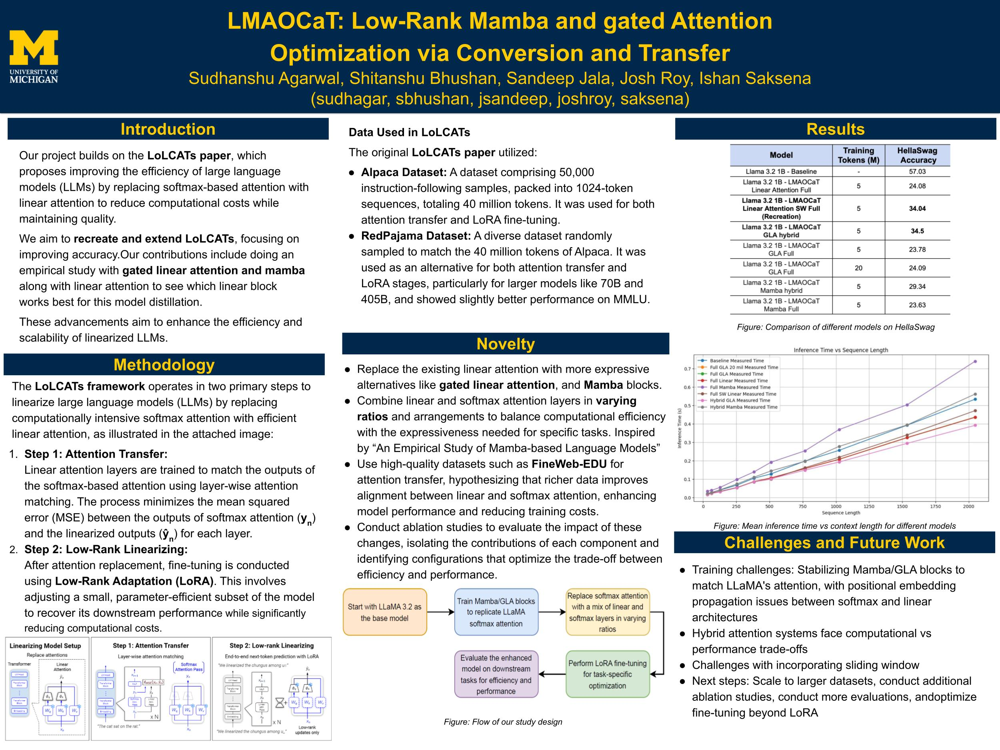

## LMAOCaT: Low-Rank Mamba and gated Attention Optimization via Conversion and Transfer

Repository for code to linearize Llama-3.2-1B

Currently contains code only for linear attention + sliding window

### To run:
1. Create and activate a virtual environment:
```bash
python -m venv .venv

# Activate virtual environment
# On Windows:
.venv\Scripts\activate
# On macOS/Linux:
source .venv/bin/activate
```
2. Install requirements:
```bash
pip install -r requirements.txt
```

3. Run the notebooks in the following order:
```bash
# Attention Transfer
Llama_attn_transfer.ipynb

# LoRA fintune
llama_lora_finetune.ipynb

# Evaluation
Linear_llama_eval_inference_speed.ipynb
MMLU_eval-0shot.ipynb
MMLU_eval-5shot.ipynb
```

### Poster for the Project:
**Outdated and does not reflect accurate results**

